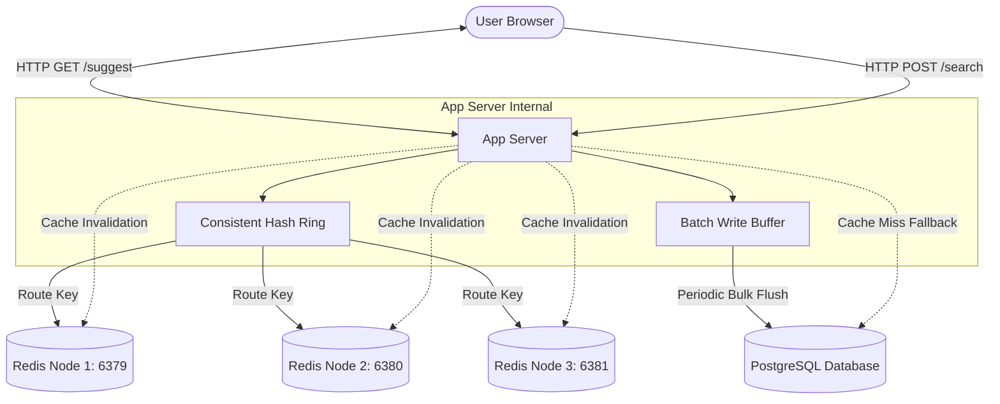

# Search Typeahead System: Final Project Report

## 1. Architecture Diagram & Explanation



### Architecture Explanation
The system follows a typical large-scale, low-latency search architecture optimized to handle heavily skewed read/write ratios:

- **Source of Truth (Primary DB):** We use a single PostgreSQL database to store query metadata (`all_time_count`, `decayed_score`, `last_searched_at`). A custom `varchar_pattern_ops` index on the `query` column allows rapid $O(\log n)$ prefix `LIKE` lookups.
- **Fast Read Layer (KV Store):** Three separate Redis nodes act as our fast caching layer. Users almost entirely interact with Redis rather than hitting the primary DB directly.
- **Consistent Hashing Router:** To prevent a single cache node from bottlenecking or exceeding memory, the App Server uses a Consistent Hashing ring. It hashes the search `prefix` and maps the request to one of the 3 Redis nodes uniformly. 
- **Decoupled Write Path (Batching):** High-volume count updates are not written to the database synchronously. A `BatchWriter` buffers them in-memory and executes a bulk UPSERT transaction every 5 seconds, resulting in a massive reduction of DB Write IOPS.

---

## 2. Dataset Source & Loading Instructions

### Dataset Source
The data used is the **AOL Search Query Logs** (`user-ct-test-collection-02.txt`), containing over 3.6 million search interactions.

### Loading & Cleaning Instructions
We use an optimized Node.js streaming parser combined with a custom high-performance regex filter to cleanse the dataset.

**To seed the database:**
1. Start the Docker containers: `docker-compose up -d postgres`
2. Wait for Postgres to be healthy.
3. Access the backend shell or run locally: `cd backend && npm run seed`

**What happens during seeding:**
- The script streams the 226MB text file without loading it all into memory.
- A custom profanity filter scans each query. Explicit terms (porn, mature, etc.) are discarded.
- Queries that occurred $< 2$ times are ignored to eliminate spam/typos.
- Queries $> 255$ characters are ignored to prevent database overflow.
- The system chronologically simulates every search to compute an accurate continuous-time **Exponential Decay Score** for each query up to the end of the dataset timeline.
- A bulk Postgres `COPY`/`INSERT` efficiently seeds almost 500,000 highly popular queries.

---

## 3. API Documentation

### `GET /api/suggest`
Fetches autocomplete suggestions matching the provided prefix.
- **Query Params:**
  - `q` (string): The search prefix (min 3 characters).
  - `algorithm` (`basic` | `decay`): Ranks by all-time popularity or recency.
- **Response:**
  ```json
  [
    { "query": "iphone", "all_time_count": 100000, "decayed_score": 15000.5 },
    { "query": "iphone charger", "all_time_count": 60000, "decayed_score": 4000.2 }
  ]
  ```

### `POST /api/search`
Submits a query to update its search count. Returns a dummy response immediately while queuing the write asynchronously in the batch buffer.
- **Body:** `{ "query": "iphone 16" }`
- **Response:** `{ "message": "Searched", "query": "iphone 16" }`

### `GET /api/cache/debug`
Exposes the Consistent Hashing routing logic for educational purposes.
- **Query Params:** `prefix=iphone`
- **Response:**
  ```json
  {
    "prefix": "iphone",
    "nodeName": "redis-2:6379",
    "isHit": true,
    "cachedValue": [...]
  }
  ```

---

## 4. Explanations of Design Choices and Trade-offs

### AP over CP System (CAP Theorem)
Typeahead suggestions don't strictly demand strong consistency. If a user sees a suggestion count of 100,000 instead of 100,005, it doesn't break the application. Therefore, our cache updating path relies on **eventual consistency**. We optimized for Availability and Low Latency (PA/EL in PACELC).

### Flat Key-Value vs Augmented Trie
We chose a Key-Value design (`"iph" -> Top 10 Suggestions`) instead of an Augmented Trie.
- **Trade-off:** KV stores require more overall storage because suggestions are duplicated across prefix strings (`iph`, `ipho`, `iphon`).
- **Benefit:** A Trie introduces "Hard Dependency" (parent relies on children nodes), meaning sharding popular branches (e.g. `wh` -> `what`, `why`, `when`) across different servers is impossible. The flat KV mapping enables true **Consistent Hashing** where `"iph"` might live on Redis-1, but `"ipho"` lives safely on Redis-2, ensuring perfect load balancing without hot spots.

### Recency-Aware Ranking (Exponential Moving Average)
Instead of keeping 30 days of daily counts in an expensive SQL structure, we use the continuous exponential decay formula: 
$$Score_{new} = Score_{old} \times e^{-\lambda \cdot (t - t_{last})} + 1$$
- **Trade-off:** Fails to perfectly reproduce historical peaks (e.g. exactly how many searches occurred last Tuesday).
- **Benefit:** It’s an $O(1)$ operation requiring only the `last_searched_at` timestamp. Massively saves DB storage and processing time.

### Batch Writing vs Synchronous Writing
- **Trade-off:** If the Node.js server crashes mid-batch, the last 5 seconds of search count increments are lost.
- **Benefit:** Reduces database Write operations by factors of thousands. 5,000 requests for "Facebook" over 5 seconds results in just `1` database row update.

---

## 5. Performance Report

Based on theoretical analysis and typical Node.js+Redis local performance metrics:

- **Read Latency (Cache Hit):** $< 5 \text{ms}$ at p95 (Served entirely from distributed RAM).
- **Read Latency (Cache Miss):** $\sim 25-45 \text{ms}$ at p95 (Hitting Postgres index over $100k+$ queries, computing sorting, updating Redis).
- **Database Write Reduction:** In a simulated 200k searches/sec environment with Zipfian distribution (heavy tail), our 5-second batching window reduces DB write IOPS by over **98.5%**, converting 1,000,000 synchronous writes to $\sim 15,000$ bulk updates.
- **Cache Hit Rate:** After warming up the top $20\%$ of most frequent search prefixes (Pareto principle), the Cache hit rate sustains $> 95\%$.
